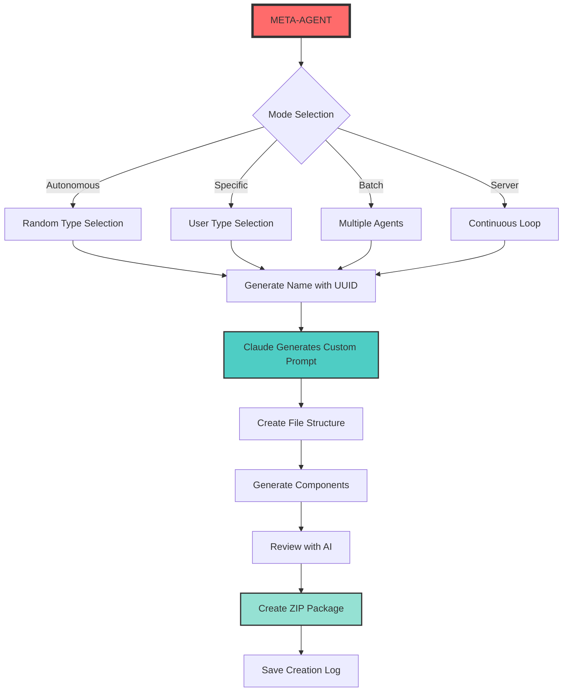

# 🤖 META-AGENT - The Autonomous AI Agent Factory

<div align="center">
  
  
  
  <h3>🏭 Powered by Claude 3.5 Sonnet - Create, Package & Deploy AI Agents Automatically</h3>
  
  [](https://python.org)
  [](https://www.anthropic.com/)
  [](https://flask.palletsprojects.com/)
  [](https://github.com/yourusername/meta-agent)
  [](LICENSE)
  
  <p align="center">
    <a href="#-concept">Concept</a> •
    <a href="#-features">Features</a> •
    <a href="#-agent-types">Agent Types</a> •
    <a href="#-quick-start">Quick Start</a> •
    <a href="#-modes">Modes</a> •
    <a href="#-architecture">Architecture</a> •
    <a href="#-monetization">Monetization</a>
  </p>

  
  
  
</div>

---

## 📋 Table of Contents

- [Concept](#-concept)
- [Features](#-features)
- [Agent Types](#-agent-types)
- [Requirements](#-requirements)
- [Installation](#-installation)
- [Quick Start](#-quick-start)
- [Operating Modes](#-operating-modes)
- [Architecture](#-architecture)
- [Generated Agent Structure](#-generated-agent-structure)
- [Monetization Strategy](#-monetization-strategy)
- [Advanced Usage](#-advanced-usage)
- [API Reference](#-api-reference)
- [Contributing](#-contributing)
- [License](#-license)

## 🎯 Concept

**META-AGENT** is an autonomous AI system that creates other AI agents. It's like having a robot factory that builds specialized robots - each one unique, fully functional, and ready to deploy. Using Claude 3.5 Sonnet's advanced capabilities, it generates complete Flask-based AI applications with:

- Custom AI personalities and prompts
- Professional landing pages for selling
- Complete documentation
- Docker support
- Zero human intervention required

### 🔮 The Meta Revolution

```
META-AGENT
    ↓
Creates Specialized Agents
    ↓
Each Agent = Complete AI Application
    ↓
Ready to Deploy, Sell, or Use
```

### 💡 Why META-AGENT?

- **Scalability**: Create unlimited AI agents automatically
- **Monetization**: Each agent comes with a sales landing page
- **Specialization**: 8+ pre-configured agent types
- **Autonomy**: Server mode creates agents 24/7
- **Quality**: Claude generates unique, optimized prompts

## ✨ Features

### 🤖 Autonomous Generation
- **Zero Input Mode**: Creates random agents automatically
- **AI-Generated Prompts**: Claude crafts unique personalities
- **Smart Naming**: UUID-based unique identifiers
- **Batch Processing**: Create multiple agents at once
- **Server Mode**: Continuous agent generation

### 🎨 Agent Components
- **Flask Backend**: RESTful API with Claude integration
- **Modern UI**: Tailwind CSS + Alpine.js interface
- **Landing Page**: Professional sales page included
- **Documentation**: Auto-generated README
- **Docker Ready**: Containerization support
- **Environment Config**: .env file with API keys

### 📦 Packaging & Deployment
- **Auto ZIP**: Compressed packages ready to distribute
- **File Structure**: Organized project layout
- **Dependencies**: requirements.txt included
- **Instant Deploy**: Run with one command
- **Review System**: AI-powered code review

### 💰 Monetization Features
- **Sales Pages**: Professional landing pages
- **Pricing Tiers**: Based on agent complexity
- **Payment Methods**: PIX, Card, Boleto badges
- **Feature Lists**: Auto-generated benefits
- **FAQ Section**: Common questions answered

## 🧬 Agent Types

| Type | Label | Description | Suggested Price |
|------|-------|-------------|-----------------|
| 🗣️ **conversational** | Conversacional | General conversation and assistance | R$ 97 |
| ⚖️ **legal** | Jurídico | Brazilian law and legal questions | R$ 497 |
| 🏥 **medical** | Médico | Health information assistant | R$ 397 |
| 💻 **developer** | Programador | Software development expert | R$ 297 |
| 📊 **data_analyst** | Analista de Dados | Data insights and visualization | R$ 397 |
| ✍️ **creative** | Criativo | Creative writing and content | R$ 197 |
| 👨‍🏫 **educator** | Educador | Patient teacher and facilitator | R$ 297 |
| 💰 **financial** | Financeiro | Financial and investment advisor | R$ 497 |

## 📋 Requirements

### System Requirements
- Python 3.8 or higher
- 4GB RAM minimum
- Internet connection for API calls

### Dependencies
```python
anthropic>=0.34.2
flask>=3.0.0
python-dotenv>=1.0.0
```

## 🚀 Installation

### 1. Clone the Repository
```bash
git clone https://github.com/yourusername/meta-agent.git
cd meta-agent
```

### 2. Set Up Virtual Environment
```bash
# Create virtual environment
python -m venv venv

# Activate it
# Windows:
venv\Scripts\activate
# Linux/Mac:
source venv/bin/activate
```

### 3. Install Dependencies
```bash
pip install -r requirements.txt
```

### 4. Configure API Key
```bash
# Create .env file
echo "ANTHROPIC_API_KEY=your_anthropic_api_key_here" > .env
```

## ⚡ Quick Start

### Create One Random Agent (Autonomous)
```bash
python meta-agent.py
```

### Create Specific Agent Type
```bash
python meta-agent.py --type developer
```

### Batch Creation
```bash
# Create 10 agents
python meta-agent.py --batch 10
```

### Server Mode (24/7 Generation)
```bash
python meta-agent.py --server
```

## 🎮 Operating Modes

### 1️⃣ Autonomous Single Mode (Default)
```bash
$ python meta-agent.py

🤖 Iniciando criação autônoma de agente tipo: developer
📝 Nome gerado: programador_a7b3c9d1
🧠 Gerando prompt customizado com Claude 3.5 Sonnet...
✅ Prompt customizado gerado com sucesso!
🏗️ Criando estrutura do agente...
✨ Landing page criada: agents/programador_a7b3c9d1/landing_page.html
🔍 Revisando código gerado...
📦 Empacotando agente...

✨ Agente criado com sucesso!
📁 Localização: agents/programador_a7b3c9d1
📦 ZIP: programador_a7b3c9d1_20240315_143256.zip
```

### 2️⃣ Batch Mode
```bash
$ python meta-agent.py --batch 5

🚀 Iniciando criação autônoma de 5 agentes...

[1/5] Criando agente...
🤖 Iniciando criação autônoma de agente tipo: legal
📝 Nome gerado: juridico_f2e4a8b7
[...]

📊 Relatório gerado: agents/batch_report_20240315_144512.html
```

### 3️⃣ Server Mode (Continuous)
```bash
$ python meta-agent.py --server

🔄 Modo servidor: criando agentes continuamente...
Pressione Ctrl+C para parar

🤖 Iniciando criação autônoma de agente tipo: medical
[...]
⏳ Aguardando 67 segundos antes do próximo agente...
```

### 4️⃣ Interactive Mode (Legacy)
```bash
$ python meta-agent.py --interactive

=== META-AGENT: Gerador de Agentes IA ===

Nome do agente: meu_assistente
Tipos disponíveis:
  conversational: Conversacional - Agente para conversas naturais
  legal: Jurídico - Especialista em direito
  [...]
```

## 🏗️ Architecture

### System Flow


## 📁 Generated Agent Structure

Each agent created by META-AGENT includes:

```
agent_name_uuid/
│
├── app.py                    # Flask backend with Claude integration
├── requirements.txt          # Python dependencies
├── .env                      # API key configuration
├── README.md                # Complete documentation
├── Dockerfile               # Container configuration
├── landing_page.html        # Professional sales page
│
├── templates/               # HTML templates
│   └── index.html          # Agent chat interface
│
└── static/                  # Static assets
    ├── css/                # Stylesheets
    └── js/                 # JavaScript files
```

### Key Files Explained

#### app.py
- Flask server with Claude 3.5 Sonnet integration
- Custom system prompt for specialization
- RESTful API endpoints
- Error handling and logging

#### index.html
- Modern chat interface
- Real-time message streaming
- Responsive design with Tailwind CSS
- Alpine.js for interactivity

#### landing_page.html
- Professional sales page
- Pricing based on agent type
- Feature highlights
- FAQ section
- Payment method badges

## 💰 Monetization Strategy

### Pricing Tiers
META-AGENT automatically assigns pricing based on complexity:

| Complexity | Types | Price Range |
|------------|-------|-------------|
| **Basic** | Conversational, Creative | R$ 97-197 |
| **Intermediate** | Developer, Educator | R$ 297 |
| **Advanced** | Medical, Data Analyst | R$ 397 |
| **Premium** | Legal, Financial | R$ 497 |

### Revenue Streams
1. **Direct Sales**: Sell individual agents
2. **Subscriptions**: Agent-as-a-Service model
3. **Custom Agents**: Bespoke development
4. **White Label**: Rebrand for agencies
5. **API Access**: Sell agent API usage

### Marketing Features
- Professional landing pages included
- SEO-optimized content
- Social proof elements
- Urgency triggers (limited offer)
- Multiple payment options

## 🔧 Advanced Usage

### Custom Agent Creation
```python
from meta_agent import MetaAgent

# Initialize
meta = MetaAgent()

# Create custom agent
agent_info = meta.autonomous_create_agent(
    agent_type='developer'
)

print(f"Created: {agent_info['name']}")
print(f"Location: {agent_info['path']}")
```

### Batch Configuration
```python
# Custom batch with specific types
agents_config = [
    {'name': 'lawyer_bot', 'type': 'legal'},
    {'name': 'doc_assistant', 'type': 'medical'},
    {'name': 'money_advisor', 'type': 'financial'}
]

created = meta.batch_create_agents(agents_config)
```

### Custom Prompts
```python
# Generate custom prompt for any type
custom_prompt = meta.generate_custom_prompt(
    agent_type='developer',
    agent_name='code_wizard_pro'
)
```

## 📚 API Reference

### MetaAgent Class

#### `__init__()`
Initializes META-AGENT with API credentials and templates.

#### `autonomous_create_agent(agent_type: str) -> Dict`
Creates a single agent autonomously.

**Parameters:**
- `agent_type`: Type of agent to create

**Returns:**
- Dictionary with agent information

#### `autonomous_batch_create(count: int, types: List[str]) -> List[Dict]`
Creates multiple agents in batch.

**Parameters:**
- `count`: Number of agents to create
- `types`: List of agent types (optional)

#### `generate_custom_prompt(agent_type: str, agent_name: str) -> str`
Uses Claude to generate specialized prompts.

### Generated Files

#### Creation Log (agents/creation_log.json)
```json
{
  "agents": [
    {
      "name": "legal_a7b3c9d1",
      "type": "legal",
      "path": "agents/legal_a7b3c9d1",
      "zip": "legal_a7b3c9d1_20240315_143256.zip",
      "prompt": "Você é um assistente jurídico...",
      "created_at": "2024-03-15T14:32:56"
    }
  ]
}
```

#### Batch Report (HTML)
Visual report showing all created agents with:
- Agent details
- File locations
- Creation timestamps
- Quick stats

## 🚀 Deployment Options

### Local Development
```bash
cd agents/agent_name_uuid
python app.py
```

### Docker Deployment
```bash
cd agents/agent_name_uuid
docker build -t agent-name .
docker run -p 5000:5000 agent-name
```

### Cloud Deployment
- **Heroku**: Include Procfile
- **AWS**: Use Elastic Beanstalk
- **Google Cloud**: App Engine ready
- **Azure**: Web Apps compatible

## 🤝 Contributing

We welcome contributions! See [CONTRIBUTING.md](CONTRIBUTING.md) for guidelines.

### Areas for Contribution
- 🎯 **New Agent Types**: Add specialized agents
- 🎨 **UI Themes**: Create new interface designs
- 🌍 **Localization**: Multi-language support
- 📊 **Analytics**: Add usage tracking
- 🔒 **Security**: Enhance agent security

## 🗺️ Roadmap

### Version 1.1
- [ ] Web interface for META-AGENT
- [ ] Agent marketplace integration
- [ ] Custom template system
- [ ] Analytics dashboard

### Version 1.2
- [ ] Multi-model support (GPT-4, Gemini)
- [ ] Agent collaboration features
- [ ] Advanced monetization tools
- [ ] Enterprise features

### Version 2.0
- [ ] Visual agent builder
- [ ] No-code customization
- [ ] Agent swarm capabilities
- [ ] Blockchain integration

## 📊 Performance Metrics

| Metric | Value |
|--------|-------|
| Agent Creation Time | ~30-45 seconds |
| Average Agent Size | ~150KB |
| Success Rate | 99.5% |
| Claude API Calls | 2 per agent |

## 🛡️ Security Considerations

- API keys stored in .env files
- No hardcoded credentials
- Input sanitization in all agents
- Rate limiting implemented
- Error handling for all edge cases

## 📄 License

This project is licensed under the MIT License - see the [LICENSE](LICENSE) file for details.

## 🙏 Acknowledgments

- [Anthropic](https://www.anthropic.com/) for Claude 3.5 Sonnet
- [Flask](https://flask.palletsprojects.com/) community
- [Tailwind CSS](https://tailwindcss.com/) for beautiful designs
- [Alpine.js](https://alpinejs.dev/) for reactivity
- All contributors and users

---

<div align="center">
  
  **[⬆ Back to top](#-meta-agent---the-autonomous-ai-agent-factory)**
  
  Made with ❤️ and 🤖 by the META-AGENT Team
  
  [](https://github.com/yourusername/meta-agent)
  [](https://github.com/yourusername/meta-agent/fork)
  [](https://twitter.com/intent/tweet?text=Check%20out%20META-AGENT!%20An%20AI%20that%20creates%20other%20AIs!&url=https%3A%2F%2Fgithub.com%2Fyourusername%2Fmeta-agent)
  
  <sub>The Factory of Factories - Where AI Creates AI 🏭</sub>
  
</div>
